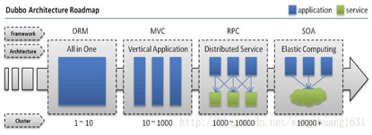
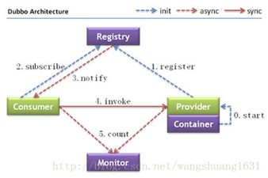
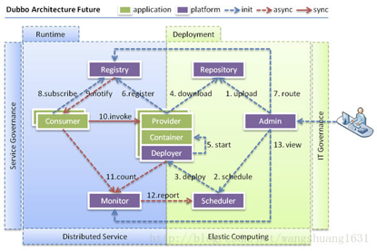
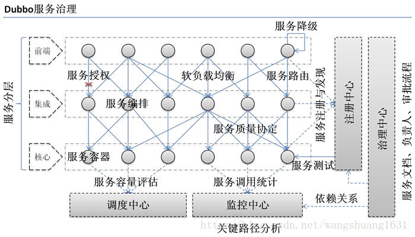

# 一.Dubbo概述 #
 
## 1.1 Dubbo的背景  ##

> 随着互联网的发展，网站应用的规模不断扩大，常规的垂直应用架构已无法应对，分布式服务架构以及流动计算架构势在必行，亟需一个治理系统确保架构有条不紊的演进。 

- 单一应用架构 
  
  当网站流量很小时，只需一个应用，将所有功能都部署在一起，以减少部署节点和成本。 
  此时，用于简化增删改查工作量的 数据访问框架(ORM) 是关键。
 
- 垂直应用架构
  
  当访问量逐渐增大，单一应用增加机器带来的加速度越来越小，将应用拆成互不相干的几个应用，以提升效率。 
  此时，用于加速前端页面开发的 Web框架(MVC) 是关键。
  
- 分布式服务架构
   
  当垂直应用越来越多，应用之间交互不可避免，将核心业务抽取出来，作为独立的服务，逐渐形成稳定的服务中心，使前端应用能更快速的响应多变的市场需求。 
  此时，用于提高业务复用及整合的 分布式服务框架(RPC) 是关键。
  
- 流动计算架构

  当服务越来越多，容量的评估，小服务资源的浪费等问题逐渐显现，此时需增加一个调度中心基于访问压力实时管理集群容量，提高集群利用率。 
 
## 1.2 什么是Dubbo ##
   Dubbo是一个分布式服务框架，致力于提供高性能和透明化的RPC远程服务调用方案，SOA服务治理方案。简单的说，dubbo就是个服务框架，如果没有分布式的需求，其实是不需要用的，只有在分布式的时候，才有dubbo这样的分布式服务框架的需求，并且本质上是个服务调用，说白了就是个远程服务调用的分布式框架。告别Web Service模式中的wsdl,以服务者与消费者的方式在dubbo 上注册)。
   其核心部分包含:
   
   1.远程通讯，提供对多种基于长连接的NiO框架抽象封装，包括多种线程模型，序列化，以及“请求一响应”模式的信息交换方式。
   
   2.集群容错: 提供基于接口方法的透明远程过程调用，包括多协议支持。以及负载均衡，失败容错，地址路由，动态配置等集群支持。
 
   3.自动发现:基于注册中心目录服务，使用服务消费能动态查找服务提供方,使地址透明,使用服务提供方可以平滑增加或减少服务器
    
## 1.3 Dubbo能做什么 ##
   问题:
    - 服务的URL管理非常困难(rmi://、http:*、)
    - F5负载均衡器的单点压力(硬件成本)
    - 各个服务之间依赖管理非常复杂
    - 各个服务之间如何进行监控
    
   1.透明化的远程方法调用，就像调用本地方法一样调用远程方法，只需简单
   配置，没有任何API侵入。
    
   2.软负载均衡及容错机制，可在内网替代F5等硬件负鞭均衡器，降低成本，
   减少单点。
     
   3.服务自动注册与发现，不再需要写死服务提供方地址，注册中心基于楼口
   名查询服务提供者的IP地址，并且能够平滑添加或删除服务提供者。

   4.Dubbo采用全Spring 配置方式，功明化接入应用，对应用没有任何API侵害，只需用Spring加载Dubbo的配置即可，Dubbo基FSpring的Schema扩入，展进行加载。
  
## 1.4 dubbo 框架

### 节点角色说明： ###
      - Provider: 暴露服务的服务提供方。 
      - Consumer: 调用远程服务的服务消费方。 
      - Registry: 服务注册与发现的注册中心。 
      - Monitor: 统计服务的调用次调和调用时间的监控中心。
   
### 调用关系说明： ###
      - 服务容器负责启动，加载，运行服务提供者。 
      - 服务提供者在启动时，向注册中心注册自己提供的服务。 
      - 服务消费者在启动时，向注册中心订阅自己所需的服务。 
      - 注册中心返回服务提供者地址列表给消费者，如果有变更，注册中心将基于长连接推送变更数据给消费者。 
      - 服务消费者，从提供者地址列表中，基于软负载均衡算法，选一台提供者进行调用，如果调用失败，再选另一台调用。 
      - 服务消费者和提供者，在内存中累计调用次数和调用时间，定时每分钟发送一次统计数据到监控中心。
   
   -- 连通性： 
    
         注册中心负责服务地址的注册与查找，相当于目录服务，服务提供者和消费者只在启动时与注册中心交互，注册中心不转发请求，压力较小 
      监控中心负责统计各服务调用次数，调用时间等，统计先在内存汇总后每分钟一次发送到监控中心服务器，并以报表展示 
      服务提供者向注册中心注册其提供的服务，并汇报调用时间到监控中心，此时间不包含网络开销 
      服务消费者向注册中心获取服务提供者地址列表，并根据负载算法直接调用提供者，同时汇报调用时间到监控中心，此时间包含网络开销 
      注册中心，服务提供者，服务消费者三者之间均为长连接，监控中心除外 
      注册中心通过长连接感知服务提供者的存在，服务提供者宕机，注册中心将立即推送事件通知消费者 
      注册中心和监控中心全部宕机，不影响已运行的提供者和消费者，消费者在本地缓存了提供者列表 
      注册中心和监控中心都是可选的，服务消费者可以直连服务提供者
    
### 健状性： ###
      - 监控中心宕掉不影响使用，只是丢失部分采样数据 
      - 数据库宕掉后，注册中心仍能通过缓存提供服务列表查询，但不能注册新服务 
      - 注册中心对等集群，任意一台宕掉后，将自动切换到另一台 
      - 注册中心全部宕掉后，服务提供者和服务消费者仍能通过本地缓存通讯 
      - 服务提供者无状态，任意一台宕掉后，不影响使用 
      - 服务提供者全部宕掉后，服务消费者应用将无法使用，并无限次重连等待服务提供者恢复
      
### 伸缩性： ###
      - 监控中心宕掉不影响使用，只是丢失部分采样数据 
      - 数据库宕掉后，注册中心仍能通过缓存提供服务列表查询，但不能注册新服务 
      - 注册中心对等集群，任意一台宕掉后，将自动切换到另一台 
      - 注册中心全部宕掉后，服务提供者和服务消费者仍能通过本地缓存通讯 
      - 服务提供者无状态，任意一台宕掉后，不影响使用 
      - 服务提供者全部宕掉后，服务消费者应用将无法使用，并无限次重连等待服务提供者恢复
      
### 伸缩性：###
      - 注册中心为对等集群，可动态增加机器部署实例，所有客户端将自动发现新的注册中心 
      - 服务提供者无状态，可动态增加机器部署实例，注册中心将推送新的服务提供者信息给消费者
    
### 升级性：###
      当服务集群规模进一步扩大，带动IT治理结构进一步升级，需要实现动态部署，进行流动计算，现有分布式服务架构不会带来阻力： 
     
   
          - Deployer: 自动部署服务的本地代理。
          - Repository: 仓库用于存储服务应用发布包。
          - Scheduler: 调度中心基于访问压力自动增减服务提供者。
          - Admin: 统一管理控制台。
          
   Register：注册中心
     
     Producer：生产者
     
     Consumer：消费者
     
     Subscribe:订阅
     
     Notify:通知
     
     Invoke:调用
     
     MONTOR:监控
     
     Container 容器
     
     Eureka： springCloud注册中心
   
## 1.5 Dubbo服务治理 ##
    

在大规模服务化之前，应用可能只是通过RMI或Hessian等工具，简单的暴露和引用远程服务，通过配置服务的URL地址进行调用，通过F5等硬件进行负载均衡。

1. 当服务越来越多时，服务URL配置管理变得非常困难，F5硬件负载均衡器的单点压力也越来越大。
此时需要一个服务注册中心，动态的注册和发现服务，使服务的位置透明。
并通过在消费方获取服务提供方地址列表，实现软负载均衡和Failover，降低对F5硬件负载均衡器的依赖，也能减少部分成本。

2. 当进一步发展，服务间依赖关系变得错踪复杂，甚至分不清哪个应用要在哪个应用之前启动，架构师都不能完整的描述应用的架构关系。
这时，需要自动画出应用间的依赖关系图，以帮助架构师理清理关系。

3. 接着，服务的调用量越来越大，服务的容量问题就暴露出来，这个服务需要多少机器支撑？什么时候该加机器？
为了解决这些问题，第一步，要将服务现在每天的调用量，响应时间，都统计出来，作为容量规划的参考指标。
其次，要可以动态调整权重，在线上，将某台机器的权重一直加大，并在加大的过程中记录响应时间的变化，直到响应时间到达阀值，记录此时的访问量，再以此访问量乘以机器数反推总容量。